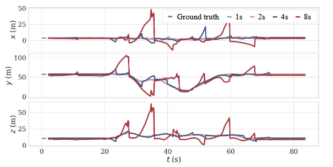

# TSFDO

This repository provides the data and selected figures used in the paper *“From Local Odometry to Global Awareness: A Two-Stage Filter-Based Distributed Odometry for Multi-Robot Systems”*, for the convenience of researchers to reference and use.
  

📄 Paper Link: [arXiv / 会议 / 期刊](https://arxiv.org/abs/xxxx)

---

## 📊 Dataset Download

This project provides partial experimental data (in ROS bag format) for reproducing the experimental results in the paper.  

- [Rosbag](https://huggingface.co/datasets/WenZhong1024/USTC-AIS-Lab_TSFDO/tree/main)  
- [Alternative link (Baidu Netdisk)](https://pan.baidu.com/s/xxxx) Extraction code: `abcd`  

> ⚠️ Note: Please cite this paper when using the dataset and comply with the open-source license.

---

## 🖼️ Related Figures

### 1. Hardware configuration used for recording the dataset
<table>
  <tr>
    <td>
      
      <p align="center"><em>figure1. UAVs used for recording the dataset</em></p>
    </td>
    <td>
      
      <p align="center"><em>figure2. Details about the UAV and the orchard mobile robot</em></p>
    </td>
  </tr>
</table>

### 2. Top-down view of the mobile robot dataset collection route

<p align="center">
  
</p>

<p align="center">
  <em>figure3.  Aerial view of the USTC High-Tech Campus</em>
</p>

### 3. Communication topology diagram used in our paper

<table>
  <tr>
    <td>
      
      <p align="center"><em>figure4. UAVs communication topology</em></p>
    </td>
    <td>
      
      <p align="center"><em>figure5. communication topology of the orchard mobile robot</em></p>
    </td>
  </tr>
</table>

### 4. Effectiveness Experiments

<table>
  <tr>
    <td>
      
      <p align="center"><em>figure6. State estimates and ground truth of Robot 2 on sequence Library_2 of dataset S3E</em></p>
    </td>
    <td>
      
      <p align="center"><em>figure7. State estimates and ground truth of Robot 3 on sequence Lawn_1 of our custom dataset</em></p>
    </td>
    
  </tr>
</table>

<table>
  <tr>
    <td>
      
      <p align="center"><em>figure8. State estimates of Robot 1 computed by Robot 1 on sequence Lawn_4 of our custom dataset</em></p>
    </td>
    <td>
      
      <p align="center"><em>figure9. State estimates of Robot 2 computed by Robot 1 on sequence Lawn_4 of our custom dataset</em></p>
    </td>
  </tr>
</table>

<table>
  <tr>
    <td>
      
      <p align="center"><em>figure10. State estimates of Robot 3 computed by Robot 1 on sequence Lawn_4 of our custom dataset</em></p>
    </td>
    <td>
      
      <p align="center"><em>figure11. State estimates of Robot 4 computed by Robot 1 on sequence Lawn_4 of our custom dataset</em></p>
    </td>
  </tr>
</table>

### 5. Accuracy Experiments

<table>
  <tr>
    <td>
      
      <p align="center"><em>figure12. Ego-state estimates of Robot 1 using different approaches on sequence Tunnel_1 of dataset S3E</em></p>
    </td>
    <td>
      
      <p align="center"><em>figure13. Ego-state estimates of Robot 2 using different approaches on sequence Tunnel_1 of dataset S3E</em></p>
    </td>
    <td>
      
      <p align="center"><em>figure14. Ego-state estimates of Robot 3 using different approaches on sequence Tunnel_1 of dataset S3E</em></p>
    </td>
    
  </tr>
</table>

### 6. Ablation Experiments
<p align="center">
  
</p>

<p align="center">
  <em>figure15.  State estimates of Robot 3 computed by Robot 1 under different communication intervals on sequence Lawn_3 in the scenario without the consensus step.
 </em>
</p>

---

## 🚀 使用方法

1. 克隆仓库  
   ```bash
   git clone https://github.com/username/repo.git
   cd repo
2. 下载数据集并放入 datasets/ 文件夹。
    ```bash
    rosbag play datasets/uav0_uav1.bag
4. 播放 rosbag：

---

## 📌 引用

如果本仓库和数据集对您的研究有帮助，请引用我们的论文：
```bash
@inproceedings{your_paper,
  title={Paper Title},
  author={Your Name and Others},
  booktitle={Conference},
  year={2025}
}
