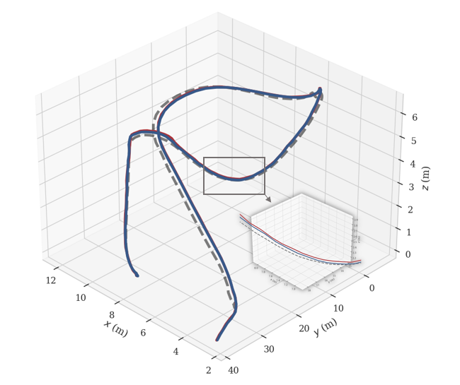
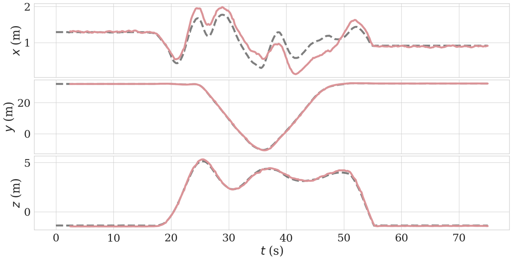

# TSFDO

<p align="center">
  
</p>

<p align="center">
  <em>figure1.  Framework of the proposed distributed odometry</em>
</p>

1. The fully distributed odometry framework for multi-robot systems cooperative localization problem with dynamic communication topologies, termed **TSFDO**, is a two-stage, filter-based approach that integrates IMU, LiDAR, and UWB measurements in a tightly-coupled invariant extended Kalman filter-based way.

2. Comparative studies against state-of-the-art cooperative localization methods confirm the superior accuracy of the proposed approach.

3. This repository provides the selected figures and data used in the paper *“From Local Odometry to Global Awareness: A Two-Stage Filter-Based Distributed Odometry for Multi-Robot Systems”*, for the convenience of researchers to reference and use.
  

📄 Related paper is available on arxiv: [TSFDO](https://arxiv.org/abs/xxxx).

---

## 📊 Dataset Download

This project provides partial experimental data (in ROS bag format) for obtaining the experimental results in the paper.  

- [Rosbag](https://huggingface.co/datasets/WenZhong1024/USTC-AIS-Lab_TSFDO/tree/main)  
- [Alternative link (Baidu Netdisk)](https://pan.baidu.com/s/xxxx) Extraction code: `****`  

> ⚠️ Note: Please cite this paper when using the dataset and comply with the open-source license.

---

## 🖼️ Related Figures

### 1. Experiment Introduction
<table>
  <tr>
    <td>
      
      <p align="center"><em>figure2. UAVs used for recording the dataset</em></p>
    </td>
    <td>
      
      <p align="center"><em>figure3. Details about the UAV and the ground vehicle</em></p>
    </td>
  </tr>
</table>

For the ground vehicle dataset, datas are collected by a single robot. Specifically, the data obtained from three different trajectories, containing IMU and LiDAR measurements, are merged into one multi-robot sequence.

<p align="center">
  
</p>

<p align="center">
  <em>figure4.  Aerial view of the collection routes in USTC High-Tech Campus</em>
</p>

Trajectories of the ground vehicle when collecting sequences: SequenceGR 1 (blue), Sequence-GR 1 (yellow), and Sequence-GR 1 (red). 

<table>
  <tr>
    <td>
      
      <p align="center"><em>figure5. Communication topology among the four UAVs</em></p>
    </td>
    <td>
      
      <p align="center"><em>figure6. Communication topology among three ground vehicles</em></p>
    </td>
  </tr>
</table>

The dashed line represents the intermitted communication.

### 2. Effectiveness Experiments

<table>
  <tr>
    <td>
      
      <p align="center"><em>figure7. State estimates and ground truth of Robot 2 on sequence Library_2 of dataset S3E</em></p>
    </td>
    <td>
      
      <p align="center"><em>figure8. State estimates and ground truth of Robot 3 on sequence Lawn_1 of our custom dataset</em></p>
    </td>
    
  </tr>
</table>

The results indicate that the UWB-based update effectively improves the accuracy of selfstate estimation, particularly for robots with larger self-state estimation errors. Even in cases where the self-state estimates are already relatively accurate, as on the sequences of custom dataset, incorporating UWB inputs still yields improvements, making the ego-state estimates more accurate.

<table>
  <tr>
    <td>
      
      <p align="center"><em>figure9. State estimates of Robot 1 computed by Robot 1 on sequence Lawn_4 of our custom dataset</em></p>
    </td>
    <td>
      
      <p align="center"><em>figure10. State estimates of Robot 2 computed by Robot 1 on sequence Lawn_4 of our custom dataset</em></p>
    </td>
  </tr>
</table>

<table>
  <tr>
    <td>
      
      <p align="center"><em>figure11. State estimates of Robot 3 computed by Robot 1 on sequence Lawn_4 of our custom dataset</em></p>
    </td>
    <td>
      
      <p align="center"><em>figure12. State estimates of Robot 4 computed by Robot 1 on sequence Lawn_4 of our custom dataset</em></p>
    </td>
  </tr>
</table>

It can be clearly observed that the robot is able to estimate the states of all other individuals under the connected communication topology, even during intervals when two robots cannot directly exchange information.

### 3. Accuracy Experiments

<table>
  <tr>
    <td>
      
      <p align="center"><em>figure13. Ego-state estimates of Robot 1 using different approaches on sequence Tunnel_1 of dataset S3E</em></p>
    </td>
    <td>
      
      <p align="center"><em>figure14. Ego-state estimates of Robot 2 using different approaches on sequence Tunnel_1 of dataset S3E</em></p>
    </td>
    <td>
      
      <p align="center"><em>figure15. Ego-state estimates of Robot 3 using different approaches on sequence Tunnel_1 of dataset S3E</em></p>
    </td>  
  </tr>
</table>

Comparison of ego-state estimation using different approaches on Tunnel 1 clearly demonstrates the superior accuracy of TSFDO.

### 4. Ablation Experiments
<p align="center">
  
</p>

<p align="center">
  <em>figure16.  State estimates of Robot 3 computed by Robot 1 under different communication intervals on sequence Lawn_3 in the scenario without the consensus step.
 </em>
</p>

When there is no consensus step in the joint-state estimation stage, the mutual state estimation accuracy can still be maintained at a relatively higher communication frequency. As the communication interval getting longer, the mutual estimation performance degrades significantly.

---

## 🚀 Usage

1. Clone the repository  
   ```bash
   git clone https://github.com/USTC-AIS-Lab/TSFDO.git
   cd repo
2. Download the dataset and place it in the `datasets/` folder.
3. Play rosbag
   ```bash
    rosbag play datasets/Lawn_1.bag
---

## 📌 Citation

If this repository and dataset are helpful for your research, please cite our paper:
```bibtex
@inproceedings{your_paper,
  title={Paper Title},
  author={Your Name and Others},
  booktitle={arXiv},
  year={2025}
}
```
---

## 🙏 Acknowledgements

This project would not have been possible without the following resources and support:

- Thanks to the [ROS](https://www.ros.org/) community and other open-source projects such as [S3E](https://pengyu-team.github.io/S3E), [CoLRIO](https://github.com/PengYu-team/Co-LRIO), [DiSCo-SLAM](https://github.com/RobustFieldAutonomyLab/DiSCo-SLAM) for providing tools and frameworks.  
- Thanks to all team members for their collaboration during the experiments.   
